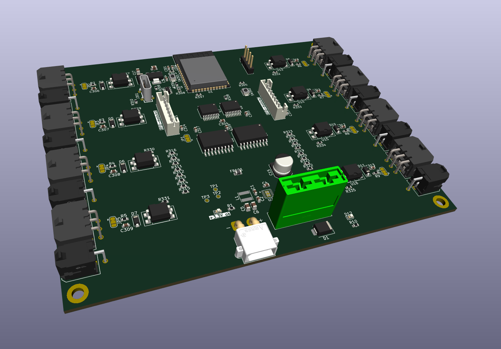

# ESP32-based control board

Custom designed control board build around ESP32-S3 module.

### Items for Discussion:

1. Board dimensions: 105 x 130 mm, 4x M3-mounting holes (3.2mm inner diameter);
2. XT30 header as main Power-input (up to 15 Amps);
3. Blade-fuse holder on the board (in light-green color);
4. 6-pin Molex MicroFit 3.0 headers for a connection with the Locks;
5. 2-pin Molex MicroFit 3.0 headers for a connection with the Lamps;
6. 0.5 Amps (at 12V) max. power delivery for each Lamp;
7. Locks and Lamps are controllable via expander-ICs over I2C-bus;
8. Normal-Closed pin of the lock switch taken by default as the input state;
9. Communication with the RFID-module is over SPI (RC522 module considered by default).

### Main features:

- ESP32-S3 as MCU with the in-built Wi-Fi and Bluetooth capabilities;
- 8 digital amplified (up to 500mA per channel) outputs to control 8x LOCKs;
- 8 digital amplified (up to 500mA per channel) outputs to control 8x LAMPs;
- 8 digital protected (optical insulation) digital inputs to get 8x LOCK-STATEs;
- Automotive-grade power supply (peak voltages resistant);

-----

### Version history

