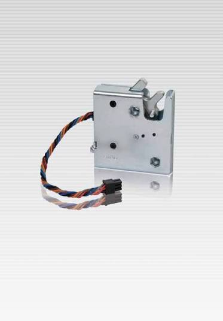

# ESP32-based control board

Custom designed control board build around ESP32-S3 module.

### Main features:

- ESP32-S3 as MCU with the in-built Wi-Fi and Bluetooth capabilities;
- 8 digital amplified (up to 500mA per channel) outputs to control 8x LOCKs;
- 8 digital amplified (up to 500mA per channel) outputs to control 8x LAMPs;
- 8 digital protected (optical insulation) digital inputs to get 8x LOCK-STATEs;
- Automotive-grade power supply (peak voltages resistant);

-----

### Version history

